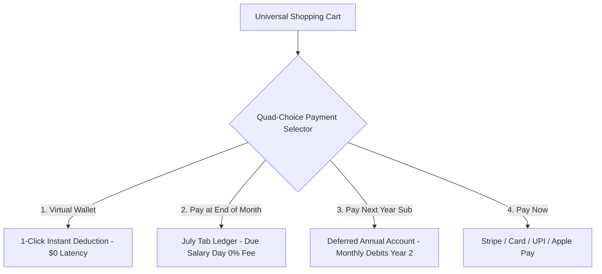
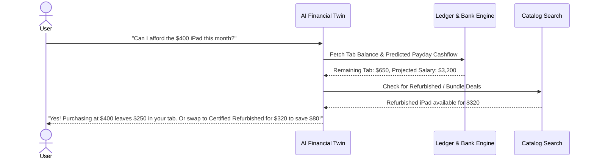

# 🚀 Master Implementation Plan: AI E-Commerce & FinTech Platform

This document outlines the complete technical architecture, feature breakdown, database schemas, and implementation roadmap for an AI-powered **Multi-Category E-Commerce Platform** featuring a **Quad-Choice Payment Gateway** (Virtual Wallet, Pay at End of Month, "Pay Next Year" Subscription, Pay Now) and an **AI Financial Twin & Health Engine**.

---

## 📌 User Review Required

> [!IMPORTANT]
> **Credit Risk & Card Vaulting Protocols:**
> 1. **"Pay Next Year" Subscription Vaulting:** Requires initial card tokenization via Stripe/Plaid e-Mandate with annual credit limit capping to prevent default risk.
> 2. **Double-Entry Ledger Auditability:** Every financial movement between Virtual Wallet, Monthly Tab, and Annual Deferred Account must maintain immutable double-entry records in PostgreSQL.
> 3. **PCI-DSS Compliance:** All card data must be tokenized; raw credentials will never be stored on local or application servers.

---

## ❓ Open Questions

> [!NOTE]
> 1. **Default Settlement Penalty:** Should late settlements for the "Pay at End of Month" tab incur a modest flat late fee after the 7-day grace period, or auto-convert into a 3-month Flexi-EMI?
> 2. **Seller Payout Timelines:** For 3rd-party marketplace sellers, should payouts occur immediately upon package delivery, or on a 14-day rolling cycle matching standard return windows?

---

## 🏗️ Proposed System Architecture & Core Modules

Below is the detailed implementation specification broken down into the 9 core feature modules.

---

### Module 1: Shopping & Multi-Category Marketplace

#### 1.1 Multi-Category Catalog
* **Categories:** Groceries, Electronics, Fashion, Home & Kitchen, Books, Digital Goods.
* **Schema:** Hierarchical taxonomy with dynamic attribute schemas per category (e.g., size/color for fashion vs voltage/RAM for electronics).

#### 1.2 Search & AI Discovery
* **Multimodal Search:** Hybrid Vector Search (Qdrant) + Lexical Search (Postgres FTS) for text, image upload, and voice queries.
* **Personalization Engine:** Real-time collaborative filtering & RAG-driven recommendations (*"Frequently Bought Together"*, *"Personalized Deals"*).

#### 1.3 Rich Product Pages
* **Interactive Media:** Multi-variant selectors, 360-degree product views, AR preview integration.
* **Trust Elements:** Verified buyer badges, photo/video reviews, community Q&A, live inventory counter (*"Only 2 remaining"*), delivery ETA calculator.

#### 1.4 Universal Shopping Cart
* **Mixed-Logistics Cart:** Consolidates local same-day grocery delivery items with standard package shipments.

---

### Module 2: Payment Methods at Checkout (Quad-Choice)

At checkout, users choose from 4 instant payment methods:



1. 👛 **Virtual Wallet:** 1-click deduction from pre-funded account with 0-second gateway delay.
2. 📅 **Pay at End of Month (Monthly Tab):** $0 today, consolidated onto the user's monthly ledger and auto-debited on salary payday at 0% fee.
3. 🗓️ **"Pay Next Year" Subscription Account:** Free shipping all year + deferred product billing. Purchase totals accumulate through Year 1 and settle in 12 monthly installments starting January 1st of Year 2 (requires initial card tokenization).
4. 💳 **Pay Now:** Instant checkout via credit/debit card, UPI, or mobile wallets.

---

### Module 3: FinTech Engine & Deferred Credit Systems

#### 3.1 Plaid / Open Banking Underwriting
* **Cashflow Velocity Scoring:** Analyzes recurring income, average daily bank balance, and spending behavior to dynamically set:
  * Monthly Tab Limit ($300 - $1,500/mo).
  * Annual Deferred Limit ($1,000 - $5,000/yr).

#### 3.2 Double-Entry Ledger System
* Immutable transaction ledger schema recording debits and credits across:
  * `USER_WALLET`
  * `MONTHLY_TAB_LEDGER`
  * `ANNUAL_DEFERRED_LEDGER`
  * `MERCHANT_PAYABLE`

#### 3.3 Flexi-EMI & Installment Conversions
* Allows users to split high-ticket purchases (e.g., a $1,200 TV) into 3, 6, or 12-month installment plans directly within their monthly or annual bills.

---

### Module 4: AI Financial Guardrails

#### 4.1 Spend Velocity Radar
* Tracks daily burn rate against remaining days in the billing cycle. Alerts user if spend speed threatens end-of-month salary targets.

#### 4.2 Affordability Assistant
* Real-time query evaluation answering *"Can I afford this item without breaching my monthly budget?"*

#### 4.3 AI Cost Swaps
* Automatically scans inventory for identical/refurbished items or bulk bundles at lower prices before order placement.

---

### Module 5: Seller Ecosystem & Merchant Tools

#### 5.1 Seller Dashboards
* Real-time analytics on sales velocity, inventory depletion, buyer demographics, and payout statements.

#### 5.2 Seller-Sponsored Credit
* Merchants can offer zero-fee tab extensions or exclusive cashback for their products to drive conversions.

---

### Module 6: Customer Support, Logistics & Rewards

#### 6.1 Real-Time Order Tracking
* Live GPS tracking for same-day grocery items alongside courier milestone tracking for standard shipments.

#### 6.2 Instant Wallet & Tab Refunds
* Upon return pickup verification, refunds immediately credit back to the user's Virtual Wallet or reduce their active Monthly Tab balance.

#### 6.3 Gamified Loyalty Program
* Timely bill repayments earn "Pantry & Tech Loyalty Points" that unlock credit limit increases, exclusive deals, and wallet cashbacks.

---

### Module 7: Predictive Budget Alerts

Proactive notification system delivering high-priority alerts:

* 🚨 **Overspending Risk Alert:** Triggers when spend velocity exceeds historical baseline by >25%.
* ⏳ **Budget Exhaustion Warning:** Triggers when 80% and 95% of monthly credit limits are reached.
* 💸 **Upcoming Bill Shortage Alert:** Predicts if projected bank account balance on salary day will be insufficient to settle the tab.
* 🎯 **Goal Delay Warning:** Alerts user if recent purchases will push back saved financial goals (e.g., vacation fund).

---

### Module 8: AI Financial Twin (Chatbot)

An intelligent personalized agent powered by LLM + RAG:



* **Contextual Memory:** Remembers past purchases, dietary preferences, and user financial goals.
* **Proactive Nudges:** Recommends optimal checkout method (Wallet vs Tab vs Pay-in-4) based on cash flow.

---

### Module 9: AI Financial Health Score

A dynamic 3-digit score (range **300 – 850**) evaluating user shopping & financial health:

* **Score Factors:**
  1. **Repayment Timeliness (35%):** Track record of settling Monthly Tabs and Annual EMI installments on time.
  2. **Budget Velocity Maintenance (25%):** Staying within AI-recommended daily spend velocity.
  3. **Credit Utilization Ratio (20%):** Percentage of total assigned credit limit used.
  4. **Savings & Wallet Health (10%):** Maintaining a non-zero Virtual Wallet balance.
  5. **Nutritional & Essential Ratio (10%):** Balanced spending between essentials (groceries) and luxury items.
* **Perks Unlocked by High Scores:**
  * Lower EMI interest rates.
  * Higher Annual Deferred Credit limits.
  * Zero-fee Instant Wallet transfers.

---

## 🗄️ Database Schema Specification (PostgreSQL)

```sql
-- 1. Users & Financial Profile
CREATE TABLE users (
    user_id UUID PRIMARY KEY DEFAULT gen_random_uuid(),
    full_name VARCHAR(255) NOT NULL,
    email VARCHAR(255) UNIQUE NOT NULL,
    wallet_balance NUMERIC(12,2) DEFAULT 0.00,
    monthly_tab_limit NUMERIC(12,2) DEFAULT 600.00,
    annual_deferred_limit NUMERIC(12,2) DEFAULT 2500.00,
    financial_health_score INT DEFAULT 750,
    created_at TIMESTAMP WITH TIME ZONE DEFAULT CURRENT_TIMESTAMP
);

-- 2. Quad-Choice Transactions Ledger
CREATE TABLE transactions (
    transaction_id UUID PRIMARY KEY DEFAULT gen_random_uuid(),
    user_id UUID REFERENCES users(user_id),
    amount NUMERIC(12,2) NOT NULL,
    payment_method VARCHAR(30) CHECK (payment_method IN ('VIRTUAL_WALLET', 'MONTHLY_TAB', 'PAY_NEXT_YEAR', 'PAY_NOW')),
    status VARCHAR(30) DEFAULT 'COMPLETED',
    description TEXT,
    created_at TIMESTAMP WITH TIME ZONE DEFAULT CURRENT_TIMESTAMP
);

-- 3. Predictive Budget Alerts Log
CREATE TABLE budget_alerts (
    alert_id UUID PRIMARY KEY DEFAULT gen_random_uuid(),
    user_id UUID REFERENCES users(user_id),
    alert_type VARCHAR(50) CHECK (alert_type IN ('OVERSPEND_RISK', 'BUDGET_EXHAUSTION', 'BILL_SHORTAGE', 'GOAL_DELAY')),
    message TEXT NOT NULL,
    is_read BOOLEAN DEFAULT FALSE,
    created_at TIMESTAMP WITH TIME ZONE DEFAULT CURRENT_TIMESTAMP
);
```

---

## 🧪 Verification Plan

### Automated Tests
* **Ledger Double-Entry Test:** Verify zero balance mismatch across Wallet, Monthly Tab, and Deferred Ledger tables (`npm run test:ledger`).
* **Quad-Choice Checkout Engine:** Unit test cart execution for all 4 payment paths (`npm run test:checkout`).
* **AI Financial Health Score Calculation:** Test score updates upon on-time vs late tab repayments (`npm run test:credit-score`).

### Manual Verification
* Simulate Quad-Choice checkout flows on staging environment.
* Test AI Financial Twin chatbot natural language responses for affordability queries.
* Validate real-time email & push notifications for Predictive Budget Alerts.
